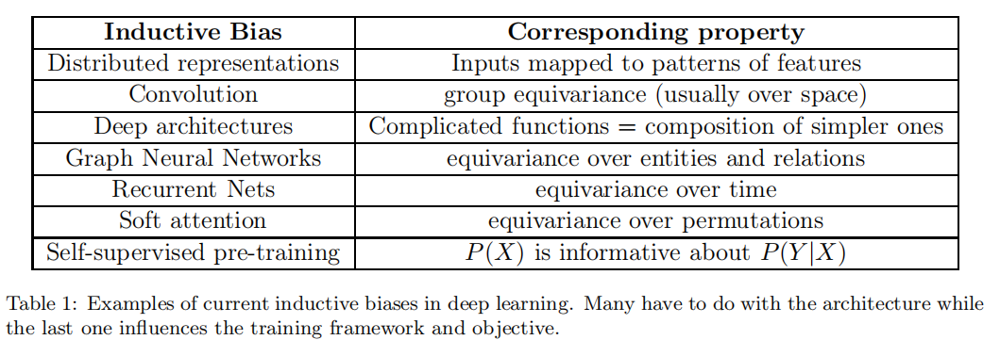

Inductive Biases for Deep Learning of Higher-Level Cognition

1. Has Deep Learning Converged?

   1.1 传统的训练-测试场景假设测试数据和训练数据有相同的分布；我们用structural-mechanistic来描述能理解现实中潜在因果关系的模型（能够正确预测从相同因果系统中取出的不同分布，而不是局限于某个具体分布）。deep learning可能需要整合更多关于agency, reasoning和causality的概念。相比于仅仅把数据看成从相同分布中的取样，需要在真实世界的非平稳过程中考虑数据的来源

2. About Inductive Biases

   no-free-lunch theorem: 没有对于所有任务适用的算法（perform equally good)

   

   如何将inductive bias转换为机器学习算法？

   Inductive Biases as Data: 可以将inductive biases, priors看成伪装的训练数据，不同的inductive biases等同于更多或者更少数据。

   Agency, Sequential Decision Making and Non-Stationary Data Streams：传统机器学习的假设：训练数据和测试数据具有同分布，样本iid；在agent根据环境进行决策的场景中并不适用；数据分布在不断变化。我们需要为learner建设一个非平稳的可控的训练环境和benchmark

   Transfer Learning and Continual Learning: 连续学习让我们想到meta learning的想法，分为fast learning和slow learning, 多个time scales, 最外层（outer loop)是evolution，内层是culture learning, 再内层是individual learning, etc.

   Systematic Generalization and Out-of-Distribution Generalization: 

   systematic generalization: 通过组分去理解一个全新的未见过的概念；e.g.科幻小说中的场景在现实中从未见过，却可以理解；当前机器学习受益的一种组合优势的形式是distributed representations, 应该更好的整合的一种形式是systematicity

3. Inductive biases based on higher-level cognition as a path towards systems that generalize better OOD

   3.1 conscious vs. unconcious

   system 1: default processing, 激活大脑的多个区域，无意识，快；直觉的模糊的知识

   system 2: controlled processing，有意识，需要system 1的支持；e.g.想象，计划；可以明确推理口头表达的知识

   **the global workspace theory**: 由许多专家组成的可以相互交流的架构，基于attention动态选择一个或多个适合任务的专家模块，某个专家修改的内容可以广播到所有专家

   3.2 Attention as dynamic information flow

   content-based soft attention: hard attention:-算完attention score直接取分值最高的向量对应的value($\alpha$为0/1）; 人实际思考更接近hard attention

   3.3 Blend of Serial and Parallel Computations

   system 2 to system 1 consolidation: system1是平行计算的，现有ML在system1方面表现很好（给输入，快速计算出结果），system2则是顺序计算。system 2 的fast learning和systematic generalization是未来ML重要的方向

   3.4 Semantic Representations Describing Verbalizable Concepts

   inductive bias: 高级的变量（意识可操控）通常是可描述的。

   单独system2的知识是不全面的，可描述的语言指向system1中意识不可接触的内容。训练自然语言理解系统时，应该把语言和它指向的东西配对(grounded language learning的想法)

   3.5 Semantic Variables Play a Causal Role and Knowledge about them is Modular

   GWT假设大脑是模块化的，有一系列专家模块稀疏地通过瓶颈进行交流，每次只有被选中的信息会通过。假设语义变量通常也是因果变量

   3.6 Local Changes in Distribution in Semantic Space

   环境的变化主要来自：1.环境本身的不平稳 2.agent决策对环境产生的影响

   这些环境的变化可以用语义形式描述

   3.7 Stable Properties of the World

   3.8 Sparse Factor Graph in the Space of Semantic Variables

   inductive bias: 高级概念间的联合分布可以用稀疏图表示， 二部图-一边是变量，另一边是factor。factor表示变量间的关系，factor或者是cause，或者是effect，构成有向二部图。图是稀疏的，分布的变化可能源于个别变量/因子的改变

   稀疏因子图类比于冯诺依曼结构

   3.9 Variables, Instances and Reusable Knowledge Pieces

   inductive bias: 不是定义具体的因子（各自有独立的参数），而是定义通用的因子模板，可以实例化

   3.10 Relevant causal chains (for learning or inference) can be approximated as very short chains

   clock-based segmentation: 按时间/空间划分

   event-based segmentation: 按事件划分（陌生的路线感觉比熟悉的路线长，因为陌生路线上有更多新事件）

   3.11 Context-dependent processing involving goals, top-down influence, and bottom-up competition

   top-down信息编码了当前场景的相关背景，先验知识；bottom-up信号构成了我们感知到的信息

4. Declarative Knowledge of Causal Structure

   4.1 Independent Causal Mechanisms

   ICM principles: 一个复杂的生成模型由独立的机制组成，相互不影响

   1.干涉一个因子$p(X_i|PA_i)$不改变其他机制$p(X_j|PA_j)$ 2.知道$p(X_i|PA_i)$无法提供$p(X_j|PA_j)$的信息

​	

​	